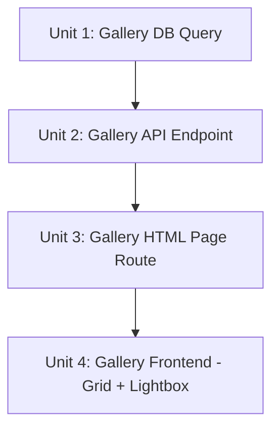

# feat: Add token-protected media gallery page with grouped display and thumbnails

## Overview

Add a new standalone gallery page (`/gallery?token=<SECRET_REPORT_TOKEN>`) that displays all uploaded photos and videos grouped by guest group. The page is token-protected (same `SECRET_REPORT_TOKEN` used by the report agent), server-rendered as a self-contained HTML page, and uses existing thumbnail/full-resolution endpoints for media serving. Image thumbnails are served through R2 directly (current behavior), and lazy loading ensures good performance with many media items.

## Problem Frame

After the wedding, the couple needs a way to see all uploaded media from all guests in one place, organized by who uploaded what. Currently, photos are only viewable per-guest-group via the authenticated photo tab. There is no cross-group media view. The gallery should be accessible via a simple token-protected URL that can be bookmarked and shared between the couple.

## Requirements Trace

- R1. Gallery page shows all uploaded media (photos and videos) across all guest groups
- R2. Media is grouped by guest group with group name as section header
- R3. Display is optimized for both images and videos (grid layout with thumbnails)
- R4. Thumbnails are used for initial display; full resolution on click/tap
- R5. Access is protected by `SECRET_REPORT_TOKEN` via `?token=` query parameter
- R6. Page loads efficiently even with many media items (lazy loading, thumbnail serving)

## Scope Boundaries

- Not adding client-side routing to the React SPA — this is a standalone server-rendered page
- Not generating server-side image thumbnails — using existing R2-served images with appropriate sizing via CSS and lazy loading. Video thumbnails already exist as pre-generated WebP files
- Not adding upload functionality to the gallery — it is read-only
- Not adding pagination initially — lazy loading handles progressive rendering. Can add if media count grows very large
- Not modifying the existing photo upload or per-group photo viewing functionality

## Context & Research

### Relevant Code and Patterns

- **Token auth pattern:** `src/server.ts:206-227` — Report agent validates `SECRET_REPORT_TOKEN` against URL param with strict equality
- **Photo list query:** `src/server.ts:426-488` — Existing per-group photo listing via QR token auth; uses `db.query.photoUploads` with guest ID filtering
- **Thumbnail endpoint:** `src/server.ts:490-567` — Video thumbnails served from `thumbnailR2Key`; image thumbnails served as full images with CF-Image response headers (note: these headers don't actually resize — the gallery will use CSS sizing + lazy loading instead)
- **Full resolution endpoint:** `src/server.ts:569-620` — Serves original files from R2 with caching headers
- **DB schema:** `src/db/photo-uploads.ts` — `photoUploads` table with `guestId` FK, `mediaType`, `r2Key`, `thumbnailR2Key`, `fileName`, `uploadedAt`
- **DB relationships:** Photos -> `guests.guestId` -> `guests.groupId` -> `guestGroups` (join path for grouping)
- **RSVP summary query:** `src/db/queries/rsvp-summary.ts` — Pattern for cross-group data aggregation using `db.query.guestGroups.findMany({ with: { guests: true } })`

### Institutional Learnings

- No `docs/solutions/` directory exists. Patterns extracted from codebase directly.
- Video thumbnails are pre-generated client-side during upload (400x400 WebP) and stored in R2 — no server-side generation needed for videos.
- Image "thumbnails" via CF-Image response headers (`CF-Image-Fit`, etc.) likely don't perform actual resizing. The gallery should not depend on server-side image resizing — instead use CSS `object-fit: cover` on `` tags with `loading="lazy"` for progressive loading.
- R2 reads go through the Worker (not direct R2 URLs) to maintain access control.

## Key Technical Decisions

- **Server-rendered HTML page (not React SPA route):** The gallery is a standalone page served by a Hono route. This avoids introducing client-side routing to the existing SPA, keeps the gallery self-contained, and simplifies token validation (server-side before rendering). The existing app has no client-side router. Rationale: Adding React Router for one page would be unnecessary complexity; a server-rendered page with vanilla JS for lightbox behavior is simpler and faster to load.

- **Reuse existing `/api/photos/:id/thumbnail` and `/api/photos/:id/full` endpoints:** The gallery HTML will reference these URLs for media. These endpoints already have `Cache-Control: public, max-age=31536000` headers. No auth check is needed on these endpoints since they use photo IDs (not guessable) and the gallery page itself is token-protected.

- **New API endpoint for cross-group media data:** `GET /api/gallery/media?token=<SECRET_REPORT_TOKEN>` returns JSON with all media grouped by guest group. This separates data fetching from HTML rendering and allows the gallery page to load media progressively via fetch after initial HTML load.

- **CSS-based thumbnail sizing (not server-side resizing):** Images are served at full resolution from the thumbnail endpoint but displayed at thumbnail size via CSS `object-fit: cover` with fixed grid dimensions. Combined with `loading="lazy"`, this provides acceptable performance. If performance becomes an issue with very many images, server-side thumbnail generation can be added later.

- **Vanilla JS lightbox (no React/framework):** The gallery page uses minimal inline JavaScript for lightbox/modal functionality (click thumbnail → show full resolution). This keeps the page self-contained without needing to bundle React for a simple viewer.

## Open Questions

### Resolved During Planning

- **How to handle the gallery route vs SPA catch-all?** The gallery route (`GET /gallery`) is defined before the SPA catch-all (`GET /*`), so Hono matches it first. The route returns server-rendered HTML directly, bypassing static asset serving.
- **How to group photos by guest group?** JOIN through `photoUploads` → `guests` → `guestGroups` using Drizzle relational queries. The `fetchRsvpSummary` pattern in `src/db/queries/rsvp-summary.ts` shows the exact approach.
- **Do existing thumbnail/full endpoints need auth changes?** No. They currently have no auth check (they use photo IDs which are UUIDs). The gallery page itself is the auth boundary.

### Deferred to Implementation

- **Exact CSS grid breakpoints and column counts** — will be determined during frontend implementation based on visual testing
- **Whether to add a download button for individual/all photos** — can be added as a follow-up if needed

## High-Level Technical Design

> *This illustrates the intended approach and is directional guidance for review, not implementation specification. The implementing agent should treat it as context, not code to reproduce.*

```
┌─────────────────────────────────────────────────┐
│  Browser: GET /gallery?token=SECRET_REPORT_TOKEN│
└───────────────────┬─────────────────────────────┘
                    │
                    ▼
┌─────────────────────────────────────────────────┐
│  Hono Route: GET /gallery                       │
│  1. Validate token against c.env.SECRET_REPORT_ │
│     TOKEN                                       │
│  2. Return self-contained HTML page with        │
│     inline CSS + JS                             │
└───────────────────┬─────────────────────────────┘
                    │
                    ▼
┌─────────────────────────────────────────────────┐
│  Browser: fetch /api/gallery/media?token=...    │
│  (page JS fetches media data after load)        │
└───────────────────┬─────────────────────────────┘
                    │
                    ▼
┌─────────────────────────────────────────────────┐
│  Hono Route: GET /api/gallery/media             │
│  1. Validate token                              │
│  2. Query all photoUploads JOIN guests JOIN      │
│     guestGroups                                 │
│  3. Return JSON grouped by guest group          │
└───────────────────┬─────────────────────────────┘
                    │
                    ▼
┌─────────────────────────────────────────────────┐
│  Browser: Render media grid                     │
│  - Group sections with headers                  │
│  -                          │
│  - <video> with poster from thumbnail           │
│  - Click → lightbox with /api/photos/:id/full   │
└─────────────────────────────────────────────────┘
```

## Implementation Units



- [ ] **Unit 1: Gallery database query function**

**Goal:** Create a reusable query function that fetches all uploaded media grouped by guest group.

**Requirements:** R1, R2

**Dependencies:** None

**Files:**
- Create: `src/db/queries/gallery-media.ts`
- Test: `src/db/queries/gallery-media.test.ts`

**Approach:**
- Follow the pattern from `src/db/queries/rsvp-summary.ts` — export a function that takes `Database` and returns structured data
- Query `guestGroups` with nested `guests` relation, then for each guest query their `photoUploads`
- Use Drizzle relational queries: `db.query.guestGroups.findMany({ with: { guests: { with: { photoUploads: true } } } })`
- This requires adding both sides of the Drizzle relation: (1) add `many(photoUploads)` to `guestsRelations` in `src/db/guests.ts`, (2) create `photoUploadsRelations` in `src/db/photo-uploads.ts` with `one(guests, { fields: [photoUploads.guestId], references: [guests.id] })`, and (3) register `photoUploadsRelations` in the schema object in `src/db/index.ts`
- Filter out groups with no media
- Sort groups alphabetically by name (ascending), media within each group by `uploadedAt` descending (newest first)
- Return typed structure: `{ groupName: string, groupId: string, mediaCount: number, media: { id, fileName, mediaType, duration, uploadedAt }[] }[]`

**Patterns to follow:**
- `src/db/queries/rsvp-summary.ts` — cross-group data aggregation pattern
- `src/db/guest-groups.ts` — relational query definitions

**Test scenarios:**
- Happy path: Multiple groups with mixed image/video uploads return correctly grouped and sorted data
- Happy path: Media within each group is sorted by uploadedAt descending
- Edge case: Groups with no uploads are excluded from results
- Edge case: Empty database returns empty array
- Edge case: Group with guests but no uploads is excluded

**Verification:**
- Function returns correctly typed, grouped, and sorted media data
- Groups without media are excluded

- [ ] **Unit 2: Gallery API endpoint**

**Goal:** Add a token-protected API endpoint that returns all media data as JSON grouped by guest group.

**Requirements:** R1, R2, R5

**Dependencies:** Unit 1

**Files:**
- Modify: `src/server.ts`

**Approach:**
- Add `GET /api/gallery/media` route in `src/server.ts` — place it near the report agent routes (after line ~278) since it shares the same auth pattern
- Validate `token` query parameter against `c.env.SECRET_REPORT_TOKEN` using constant-time comparison (same pattern as report agent at lines 206-217, but use `crypto.subtle.timingSafeEqual` or equivalent instead of `!==`)
- Call the gallery query function from Unit 1
- Return JSON response with grouped media data
- Include appropriate `Cache-Control` header (short TTL like `max-age=60` since new uploads should appear relatively quickly)

**Patterns to follow:**
- `src/server.ts:206-227` — Report agent token validation pattern
- `src/server.ts:426-488` — Photo list endpoint structure

**Test scenarios:**
- Happy path: Valid token returns grouped media JSON with correct structure
- Error path: Missing token returns 401
- Error path: Invalid token returns 401
- Happy path: Response includes all groups that have media
- Edge case: No media uploaded returns empty groups array

**Verification:**
- Endpoint returns 401 for missing/invalid tokens
- Endpoint returns correctly structured JSON for valid tokens
- Response matches the type returned by the gallery query function

- [ ] **Unit 3: Server-rendered gallery HTML page route**

**Goal:** Add a Hono route that serves a self-contained HTML gallery page with embedded CSS and JavaScript.

**Requirements:** R3, R4, R5, R6

**Dependencies:** Unit 2

**Files:**
- Modify: `src/server.ts`
- Create: `src/gallery-template.ts`

**Approach:**
- Add `GET /gallery` route in `src/server.ts` before the SPA catch-all (`GET /*`)
- Validate `token` query parameter against `c.env.SECRET_REPORT_TOKEN`; redirect to a simple "Unauthorized" page or return 401 HTML if invalid
- Return a self-contained HTML page (template function in `src/gallery-template.ts`)
- The HTML page includes:
  - Inline CSS for the gallery layout (responsive grid, dark/light theme support)
  - Inline JavaScript that fetches `/api/gallery/media?token=...` on load and renders the media grid
  - Loading state while media data is being fetched
  - Group sections with header showing guest group name and media count
- The template function takes the token as parameter so the JS can pass it to the API call
- Template returns an HTML string; the route returns it as `text/html` response with `Cache-Control: private, no-store` to prevent caching of the token-bearing page by intermediaries

**Patterns to follow:**
- `src/server.ts:206-217` — Token validation pattern
- Server-rendered HTML approach (no React needed for this standalone page)

**Test scenarios:**
- Happy path: Valid token returns HTML page with status 200 and content-type text/html
- Error path: Missing token returns 401
- Error path: Invalid token returns 401
- Happy path: HTML contains a script that fetches from `/api/gallery/media` with the token
- Integration: The gallery route is matched before the SPA catch-all

**Verification:**
- `/gallery?token=valid` returns an HTML page
- `/gallery?token=invalid` returns 401
- The HTML page contains the gallery JavaScript and CSS
- The route does not conflict with the SPA catch-all

- [ ] **Unit 4: Gallery frontend — responsive grid and lightbox**

**Goal:** Implement the gallery's client-side behavior: responsive media grid with lazy loading, group sections, and a lightbox for full-resolution viewing.

**Requirements:** R1, R2, R3, R4, R6

**Dependencies:** Unit 3

**Files:**
- Modify: `src/gallery-template.ts`

**Approach:**
- The inline JavaScript in the gallery template handles:
  1. Fetch media data from API endpoint on page load
  2. Render group sections dynamically — each with a header (`<h2>` with group name and count)
  3. Responsive CSS grid for thumbnails (3-4 columns on desktop, 2 on tablet, 1-2 on mobile)
  4. Images: `` with CSS `object-fit: cover`
  5. Videos: `<video>` element with `poster` attribute pointing to thumbnail URL, or a play icon overlay on the thumbnail image
  6. Click/tap handler opens a lightbox modal showing `/api/photos/:id/full` for images, or a `<video>` player for videos
  7. Lightbox: overlay with close button, previous/next navigation, keyboard support (Escape to close, arrow keys to navigate)
  8. Empty state: message when no media has been uploaded
  9. Error state: message when API call fails
- Style the page to match the wedding app's aesthetic (neutral colors, clean typography)
- Use `prefers-color-scheme` media query for automatic dark/light theme

**Patterns to follow:**
- `src/components/PhotoUpload.tsx` — existing media grid and lightbox patterns (lines ~350-500), adapted to vanilla JS
- `loading="lazy"` on images (already used in PhotoUpload.tsx)

**Test scenarios:**
- Happy path: Page fetches and displays media grouped by guest group with headers
- Happy path: Images display as thumbnails in a responsive grid
- Happy path: Videos display with a play indicator overlay
- Happy path: Clicking a thumbnail opens a lightbox with full-resolution view
- Happy path: Lightbox supports keyboard navigation (Escape, arrow keys)
- Edge case: Empty state shown when no media exists
- Error path: Error message displayed when API call fails
- Happy path: Lazy loading attribute present on all images
- Happy path: Page is responsive across desktop, tablet, and mobile widths

**Verification:**
- Gallery page renders media grouped by guest group
- Thumbnails load lazily as user scrolls
- Lightbox opens for both images and videos
- Page is responsive and visually clean

## System-Wide Impact

- **Interaction graph:** Two new Hono routes (`GET /gallery`, `GET /api/gallery/media`) added to `src/server.ts`. No impact on existing routes. The gallery route must be defined before the SPA catch-all to avoid being swallowed.
- **Error propagation:** Gallery API errors return JSON with `{ error: string }`. Gallery page errors return HTML error pages. No impact on existing error handling.
- **State lifecycle risks:** None — the gallery is read-only and stateless. No writes, no session state.
- **API surface parity:** The gallery API endpoint is a new surface using the same auth pattern as the report agent. No changes to existing API endpoints.
- **Integration coverage:** The main integration point is between the gallery page JS and the gallery API endpoint — covered by Unit 4 test scenarios.
- **Unchanged invariants:** Existing photo upload, per-group photo viewing, thumbnail serving, and full-resolution serving are not modified. The gallery adds a new read-only view on top of existing data and endpoints.
- **Database schema change:** Adding Drizzle relation definitions (TypeScript only, no DB migration): (1) `many(photoUploads)` in `guestsRelations` (`src/db/guests.ts`), (2) new `photoUploadsRelations` export in `src/db/photo-uploads.ts`, (3) register `photoUploadsRelations` in schema object in `src/db/index.ts`. Both sides of the relation must be defined for nested relational queries to work.

## Risks & Dependencies

| Risk | Mitigation |
|------|------------|
| Large number of media items causing slow page load | Lazy loading (`loading="lazy"`) defers off-screen image loading. Thumbnails (400x400 for videos) and CSS-sized images reduce visual weight. Short API cache TTL prevents stale data. |
| Image thumbnails served at full resolution (CF-Image headers don't resize) | CSS `object-fit: cover` with fixed grid dimensions ensures visual consistency. Actual bandwidth usage is higher than ideal but acceptable for a private gallery. Can add proper thumbnail generation later if needed. |
| Gallery route conflicting with SPA catch-all | Gallery route is defined before `GET /*` in Hono, ensuring it matches first. |
| Token exposure in URL query parameter | Same pattern as existing report agent. Token is a secret shared between couple — URL should not be shared publicly. Using query param (not path param) avoids it appearing in server logs via Hono's path logging. |

## Sources & References

- Related code: `src/server.ts` (routing, auth, photo endpoints)
- Related code: `src/db/queries/rsvp-summary.ts` (cross-group query pattern)
- Related code: `src/db/photo-uploads.ts` (schema)
- Related code: `src/components/PhotoUpload.tsx` (media grid, lightbox patterns)
- Related code: `env.d.ts` (SECRET_REPORT_TOKEN binding)
