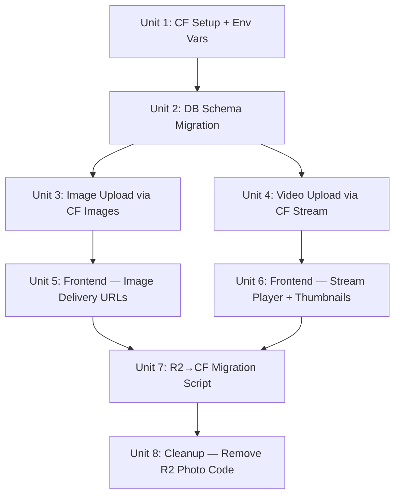

# refactor: Migrate media pipeline from R2 to Cloudflare Images + Stream

## Overview

Replace the current R2-based media storage with Cloudflare's managed services: **Cloudflare Images** for photos and **Cloudflare Stream** for videos. This eliminates all manual media processing (client-side thumbnail generation, HEIC conversion workarounds, manual edge caching, presigned URL orchestration) and replaces it with purpose-built CDN delivery, automatic format conversion, and adaptive video streaming.

Audio recordings remain in R2 — there is no Cloudflare managed service for audio.

## Problem Frame

The current R2 + manual processing approach has accumulated significant complexity and workarounds:

1. **HEIC display failures** — HEIC images from iPhones don't display on Chrome/Firefox. Required layered workarounds: client-side conversion (Safari only), server-side Image Resizing on-the-fly
2. **Video thumbnail generation hangs** — Client-side canvas-based thumbnail extraction hangs on HEVC videos (events never fire). Required timeout workarounds with fallback to no thumbnail
3. **Full-res images served as thumbnails** — No real thumbnail generation; images served at full resolution with CSS sizing, wasting bandwidth
4. **Complex upload pipeline** — Three upload paths (direct, presigned single PUT, presigned multipart), S3 SDK dependency, CORS configuration, manual R2 key management
5. **Manual edge caching** — Custom Cache API code for every serve endpoint
6. **No adaptive video streaming** — Videos served as raw MP4 files without bitrate adaptation

CF Images and Stream solve all of these as built-in features.

## Requirements Trace

- R1. All image uploads stored via Cloudflare Images with automatic format conversion (HEIC, PNG, JPEG → WebP/AVIF)
- R2. Image thumbnails served via CF Images variants (400x400 cover) — no client-side or server-side processing
- R3. All video uploads stored via Cloudflare Stream with automatic transcoding and adaptive streaming
- R4. Video thumbnails generated server-side by Stream — no client-side canvas hack
- R5. Upload UX preserved: progress reporting, error handling, retry support
- R6. Existing media migrated from R2 to CF Images/Stream
- R7. Gallery page and per-group photo tab work with new delivery URLs
- R8. Audio recordings remain in R2 (unchanged)
- R9. Remove S3 SDK dependency and presigned URL infrastructure after migration
- R10. Remove all HEIC/thumbnail workaround code

## Scope Boundaries

- Audio recordings are NOT migrated — no CF managed service for audio, R2 stays for audio
- The R2 bucket is NOT deleted — it continues serving audio. Photo/video R2 objects are deleted after successful migration
- No changes to the chat/RSVP agent, tools, or conversation flow
- No changes to authentication (QR token, admin secret, gallery token)
- Album/folder organization within CF Images is not in scope — flat storage with metadata

## Context & Research

### Relevant Code and Patterns

- **Upload pipeline:** `src/server.ts` (7 upload/confirm/multipart routes), `src/utils/r2-presign.ts` (S3 SDK wrapper), `src/utils/media-upload.ts` (client orchestrator)
- **Serve pipeline:** `src/server.ts` (`/api/photos/:id/raw`, `/thumbnail`, `/full` with CF Image Resizing + Cache API)
- **Delete pipeline:** `src/server.ts` (`DELETE /api/photos/:id` — R2 delete + D1 delete)
- **DB schema:** `src/db/photo-uploads.ts` — `r2Key`, `thumbnailR2Key`, `mimeType`, `mediaType`, `duration`
- **Frontend:** `src/components/PhotoUpload.tsx` (upload + grid + lightbox), `src/components/Gallery/GalleryPage.tsx` (admin gallery)
- **Client workarounds:** `convertHeicToWebP()`, `generateVideoThumbnail()`, `getVideoDuration()` in PhotoUpload.tsx

### External References

- **Cloudflare Images API:** Direct Creator Uploads via `POST /accounts/{id}/images/v2/direct_upload` → one-time `uploadURL`. Delivery via `https://imagedelivery.net/<hash>/<id>/<variant>`. Variants defined per-account (max 100). Accepts HEIC natively. Max 10MB per image. Metadata: JSON, max 1024 bytes.
- **Cloudflare Stream API:** Direct Creator Uploads via `POST /accounts/{id}/stream/direct_upload` → one-time `uploadURL`. Automatic thumbnails at `https://customer-<code>.cloudflarestream.com/<uid>/thumbnails/thumbnail.jpg`. HLS/DASH adaptive playback. Accepts HEVC/MOV/MP4. Max 30GB. Webhooks for processing completion.
- **Authentication:** Both services require API token via `Authorization: Bearer` header. No Worker binding for upload — REST API via `fetch()`.
- **Pricing:** Images ~$0.03/month for 500 images. Stream ~$0.25/month for 50 minutes of video. Negligible for a wedding app.

## Key Technical Decisions

- **Direct Creator Uploads for both Images and Stream:** The browser uploads directly to Cloudflare's upload URL, bypassing the Worker's 100MB body limit. The Worker only generates the one-time upload URL (lightweight API call). This is the same pattern as the current presigned URL flow but simpler (no S3 SDK, no multipart orchestration, no CORS config).

- **Keep D1 as the metadata store:** CF Images metadata (1024 bytes) is too limited for relational queries. D1 `photo_uploads` table remains the source of truth for guest→media relationships. The table gains `cloudflareImageId` or `streamVideoUid` columns; `r2Key` and `thumbnailR2Key` become nullable/deprecated.

- **Two CF Images variants: `thumbnail` and `public`:** Defined once per account via the Images API. `thumbnail` = 400x400 cover WebP. `public` = original resolution, auto-format (WebP/AVIF based on Accept header). Both served via `imagedelivery.net` — zero Worker CPU for serving.

- **Stream iframe player for video playback:** Replace raw `<video src=...>` with Stream's iframe embed or HLS manifest. This gives adaptive bitrate, better mobile experience, and server-generated thumbnails. The lightbox renders an iframe instead of a video element.

- **Audio stays in R2:** No migration. R2 bucket keeps serving audio. The `BUCKET` binding stays in wrangler.jsonc. The `@aws-sdk/client-s3` and `@aws-sdk/s3-request-presigner` dependencies can be removed since they were only used for photo/video presigned URLs.

- **Phased migration with dual-read:** During migration, serve endpoints check `cloudflareImageId`/`streamVideoUid` first, fall back to `r2Key` for not-yet-migrated items. This allows gradual migration without downtime.

## Open Questions

### Resolved During Planning

- **How to get CF account hash for imagedelivery.net URLs?** Available in Cloudflare Dashboard → Images → Overview. Store as env var `CF_IMAGES_ACCOUNT_HASH`.
- **How to get Stream customer code for cloudflarestream.com URLs?** Available in Dashboard → Stream → Overview. Store as env var `CF_STREAM_CUSTOMER_CODE`.
- **Do we need webhooks for Stream?** Yes — video processing takes time. The `readyToStream` state should be tracked in D1 so the frontend can show a "processing" indicator instead of a broken player.
- **What about the existing Image Resizing code?** Removed entirely. CF Images handles all format conversion and resizing via variants.
- **What happens to the `/api/photos/:id/raw` endpoint?** Removed — no longer needed since CF Images serves directly via CDN URLs.

### Deferred to Implementation

- **Exact Stream customer code and Images account hash** — discovered at setup time from Cloudflare Dashboard
- **Stream webhook URL path** — decided during implementation
- **Migration batch size and error handling** — tuned during the migration script implementation
- **Whether to use Stream's iframe embed or HLS manifest in the lightbox** — decided based on UX testing during implementation

## High-Level Technical Design

> *This illustrates the intended approach and is directional guidance for review, not implementation specification. The implementing agent should treat it as context, not code to reproduce.*

### Upload Flow (New)

```
Guest selects photo/video
  ↓
Browser → POST /api/media/upload-url
  (Worker validates auth, determines image vs video)
  ↓
Worker → CF Images API (direct_upload) or CF Stream API (direct_upload)
  (returns one-time uploadURL + imageId/videoUid)
  ↓
Worker → returns {uploadURL, mediaId, mediaType} to browser
  ↓
Browser → POST uploadURL with file (direct to Cloudflare CDN)
  (progress via XHR or fetch upload progress)
  ↓
Browser → POST /api/media/confirm {mediaId, fileName, ...}
  (Worker saves metadata to D1, confirms upload)
```

### Serve Flow (New)

```
Images:  
         

Videos:  
         <iframe src="https://customer-{code}.cloudflarestream.com/{uid}/iframe">
         or HLS: video.m3u8 manifest

Audio:   /api/audio/{id}  (unchanged, R2)
```

### Migration Flow

```
Admin → POST /api/admin/migrate-media?secret=X
  ↓
Worker queries D1 for all photo_uploads with r2Key but no cloudflareImageId/streamVideoUid
  ↓
For each record:
  If image → fetch from R2 → upload to CF Images API → store imageId in D1 → delete R2 object
  If video → fetch from R2 → upload to CF Stream API → store videoUid in D1 → delete R2 object
  ↓
Returns progress/results
```

## Phased Delivery

### Phase 1: Infrastructure + Schema (Units 1-2)
Set up CF Images/Stream accounts, define variants, add env vars, migrate DB schema. No behavioral change yet.

### Phase 2: New Upload Flow (Units 3-4)
Replace presigned URL upload with Direct Creator Upload for both images and videos. Remove client-side thumbnail generation and HEIC conversion.

### Phase 3: New Serve Flow (Units 5-6)
Update frontend to use CF delivery URLs. Remove Image Resizing, Cache API, and raw/thumbnail/full serve endpoints.

### Phase 4: Migration + Cleanup (Units 7-8)
Migrate existing R2 media, remove deprecated code and dependencies.

## Implementation Units



- [ ] **Unit 1: Cloudflare setup and environment configuration**

**Goal:** Configure CF Images variants, Stream account, and add required env vars/secrets to the Worker.

**Requirements:** R1, R3

**Dependencies:** None (manual Cloudflare Dashboard setup)

**Files:**
- Modify: `wrangler.jsonc`
- Modify: `env.d.ts`

**Approach:**
- In CF Dashboard → Images: create two variants: `thumbnail` (400x400, cover, WebP) and `public` (scale-down, original size, auto-format)
- In CF Dashboard → Stream: note the customer code for playback URLs
- Add env vars to `wrangler.jsonc` vars: `CF_ACCOUNT_ID` (already known: `fb0866add4b7bc5813b01a16ce090bfc`), `CF_IMAGES_ACCOUNT_HASH`, `CF_STREAM_CUSTOMER_CODE`
- Add secrets via `wrangler secret put`: `CF_IMAGES_API_TOKEN`, `CF_STREAM_API_TOKEN`
- Update `env.d.ts` with new type declarations for all new env vars
- Keep existing R2 binding — still needed for audio

**Test expectation: none** — pure infrastructure configuration, verified by Unit 3/4 integration

**Verification:**
- `wrangler.jsonc` has new env vars declared
- `env.d.ts` types match
- CF Dashboard shows thumbnail and public variants created

- [ ] **Unit 2: Database schema migration**

**Goal:** Add columns for CF Images/Stream IDs to `photo_uploads` table. Make `r2Key` nullable for the transition period.

**Requirements:** R1, R3, R6

**Dependencies:** Unit 1

**Files:**
- Modify: `src/db/photo-uploads.ts`
- Create: new Drizzle migration via `npm run db:generate`
- Test: `src/db/photo-uploads.test.ts`

**Approach:**
- Add `cloudflareImageId` (text, nullable) to `photo_uploads` — stores CF Images UUID for photos
- Add `streamVideoUid` (text, nullable) to `photo_uploads` — stores CF Stream UID for videos
- Add `streamReady` (integer/boolean, nullable, default false) — tracks whether Stream has finished processing
- Keep `r2Key` as-is (nullable existing constraint) — needed during migration
- Keep `thumbnailR2Key` — used during migration fallback, removed in Unit 8
- Run `npm run db:generate` to create migration SQL
- Apply locally with `npm run db:migrate`, apply to production with `npm run db:migrate:remote`
- Update the `GalleryGroup` type in `src/db/queries/gallery-media.ts` to include new fields

**Patterns to follow:**
- Existing migration files in `drizzle/` directory
- `src/db/photo-uploads.ts` schema pattern

**Test scenarios:**
- Happy path: New columns exist and accept null values for existing records
- Happy path: New record can be created with cloudflareImageId but no r2Key
- Edge case: Existing records with r2Key but no cloudflareImageId remain valid

**Verification:**
- Migration applies cleanly to local and remote D1
- Existing records are unaffected
- Schema types include new fields

- [ ] **Unit 3: Image upload via CF Images Direct Creator Upload**

**Goal:** Replace R2 presigned URL upload for images with CF Images Direct Creator Upload flow.

**Requirements:** R1, R2, R5, R10

**Dependencies:** Unit 2

**Files:**
- Modify: `src/server.ts` — new `POST /api/media/upload-url` route, modify `POST /api/media/confirm`
- Modify: `src/utils/media-upload.ts` — new upload flow for images
- Modify: `src/components/PhotoUpload.tsx` — remove `convertHeicToWebP`, simplify upload handler
- Test: `src/server.test.ts` or `src/utils/media-upload.test.ts`

**Approach:**
- New server route `POST /api/media/upload-url`: auth via `x-qr-token`, accepts `{fileName, contentType, mediaType}`, calls CF Images `direct_upload` API with metadata `{guestId, groupId}`, returns `{uploadURL, mediaId, mediaType: "image"}`
- Browser uploads directly to the CF Images `uploadURL` via POST with FormData (single request, no multipart orchestration, no CORS config needed)
- Modified `POST /api/media/confirm`: receives `{mediaId, cloudflareImageId, fileName, guestId, mediaType}`, inserts into D1 with `cloudflareImageId` set, no R2 interaction
- Client-side: remove `convertHeicToWebP()` entirely — CF Images handles HEIC natively
- Client-side: upload progress via XHR `upload.onprogress` to the CF uploadURL
- The `uploadFile()` function in `media-upload.ts` is simplified: no presign/multipart branching for images — single POST to uploadURL

**Patterns to follow:**
- Current `POST /api/media/presign` pattern for auth + generating URLs
- CF Images Direct Creator Upload API: `POST /accounts/{id}/images/v2/direct_upload`

**Test scenarios:**
- Happy path: JPEG upload → CF Images API called → uploadURL returned → browser uploads → confirm saves to D1 with cloudflareImageId
- Happy path: HEIC upload → CF Images accepts it, no client-side conversion needed
- Error path: CF Images API failure → 500 returned to client with clear error
- Error path: Invalid MIME type → 400 returned before calling CF API
- Edge case: Image > 10MB → CF Images limit. Return error suggesting compression or document this limit in UX
- Integration: Full flow from file select → upload → confirm → image appears in media list with CF delivery URL

**Verification:**
- Image uploads go to CF Images (visible in Dashboard)
- `convertHeicToWebP()` is deleted
- No R2 interaction for new image uploads
- D1 records have `cloudflareImageId` populated

- [ ] **Unit 4: Video upload via CF Stream Direct Creator Upload**

**Goal:** Replace R2 presigned URL upload for videos with CF Stream Direct Creator Upload flow.

**Requirements:** R3, R4, R5, R10

**Dependencies:** Unit 2

**Files:**
- Modify: `src/server.ts` — extend `POST /api/media/upload-url` for video, add Stream webhook endpoint
- Modify: `src/utils/media-upload.ts` — new upload flow for videos
- Modify: `src/components/PhotoUpload.tsx` — remove `generateVideoThumbnail`, `getVideoDuration`, `withTimeout`
- Test: `src/server.test.ts`

**Approach:**
- Extend `POST /api/media/upload-url`: when `mediaType === "video"`, call CF Stream `direct_upload` API with `maxDurationSeconds: 600` (10 min cap), return `{uploadURL, mediaId: uid, mediaType: "video"}`
- Browser uploads video directly to Stream uploadURL via POST FormData (or TUS for large files — decide during implementation)
- Modified `POST /api/media/confirm` for videos: receives `{mediaId, streamVideoUid, fileName, guestId, mediaType: "video"}`, inserts into D1 with `streamVideoUid` set and `streamReady: false`
- Add `POST /api/webhooks/stream` endpoint: receives Stream processing completion webhook, verifies signature, updates D1 `streamReady = true` and stores duration from webhook payload
- Client-side: remove `generateVideoThumbnail()` and `getVideoDuration()` — Stream handles both automatically
- Client-side: remove `withTimeout()` helper (no longer needed)

**Patterns to follow:**
- CF Stream Direct Creator Upload API: `POST /accounts/{id}/stream/direct_upload`
- Stream webhook payload format (includes `readyToStream`, `duration`, `thumbnail` URL)

**Test scenarios:**
- Happy path: MP4 upload → Stream API called → uploadURL returned → browser uploads → confirm saves to D1 with streamVideoUid
- Happy path: HEVC/MOV upload from iPhone → Stream accepts and transcodes
- Happy path: Webhook fires on processing completion → D1 updated with streamReady=true
- Error path: Stream API failure → 500 returned to client
- Error path: Webhook with invalid signature → 403 rejected
- Edge case: Video processing takes several minutes → frontend shows "spracúva sa" state for streamReady=false records
- Integration: Full flow from file select → upload → webhook → video playable in gallery

**Verification:**
- Video uploads go to CF Stream (visible in Dashboard)
- `generateVideoThumbnail()`, `getVideoDuration()`, `withTimeout()` are deleted
- Webhook updates D1 when processing completes
- No R2 interaction for new video uploads

- [ ] **Unit 5: Frontend — CF Images delivery URLs for photos**

**Goal:** Update PhotoUpload and GalleryPage to use `imagedelivery.net` URLs for photo thumbnails and full resolution.

**Requirements:** R2, R7

**Dependencies:** Unit 3

**Files:**
- Modify: `src/components/PhotoUpload.tsx` — construct CF Images URLs instead of `/api/photos/:id/thumbnail`
- Modify: `src/components/Gallery/GalleryPage.tsx` — same
- Modify: `src/db/queries/gallery-media.ts` — include `cloudflareImageId` in query output
- Modify: `src/server.ts` — modify `GET /api/photos` list endpoint to return CF delivery URLs

**Approach:**
- URL pattern: `https://imagedelivery.net/${CF_IMAGES_ACCOUNT_HASH}/${cloudflareImageId}/${variant}`
- The account hash is passed to frontend via the photos list API response (or injected into the page)
- For records with `cloudflareImageId`: use CF Images URLs for both thumbnail and full
- For records without `cloudflareImageId` (not yet migrated): fall back to existing `/api/photos/:id/thumbnail` and `/full` endpoints
- Photo list endpoint (`GET /api/photos`): returns `cloudflareImageId` for each record. Frontend constructs URLs
- Gallery API (`GET /api/gallery/media`): same — include `cloudflareImageId` in response

**Patterns to follow:**
- Current URL construction in `GET /api/photos` response: `thumbnailUrl: /api/photos/${id}/thumbnail`
- CF Images delivery URL format: `https://imagedelivery.net/<hash>/<id>/<variant>`

**Test scenarios:**
- Happy path: Photo with cloudflareImageId renders via imagedelivery.net URL in grid and lightbox
- Happy path: Gallery page displays CF Images thumbnails grouped by guest group
- Edge case: Photo without cloudflareImageId (pre-migration) falls back to Worker endpoint
- Happy path: Full resolution view uses `public` variant URL
- Integration: Mixed gallery (some migrated, some not) displays all photos correctly

**Verification:**
- New image uploads display via `imagedelivery.net` URLs
- Pre-migration images still display via fallback endpoints
- No broken images in gallery or photo tab

- [ ] **Unit 6: Frontend — Stream player and thumbnails for videos**

**Goal:** Update PhotoUpload and GalleryPage to use CF Stream for video playback and thumbnails.

**Requirements:** R3, R4, R7

**Dependencies:** Unit 4

**Files:**
- Modify: `src/components/PhotoUpload.tsx` — Stream player in lightbox, Stream thumbnail in grid
- Modify: `src/components/Gallery/GalleryPage.tsx` — same
- Modify: `src/db/queries/gallery-media.ts` — include `streamVideoUid`, `streamReady` in query output
- Modify: `src/server.ts` — modify list endpoints to return Stream data

**Approach:**
- Video thumbnail URL: `https://customer-${CF_STREAM_CUSTOMER_CODE}.cloudflarestream.com/${streamVideoUid}/thumbnails/thumbnail.jpg`
- Video playback: Stream iframe embed `https://customer-${code}.cloudflarestream.com/${uid}/iframe` in lightbox, or HLS manifest for native `<video>` with adaptive bitrate
- For videos with `streamVideoUid` and `streamReady === true`: use Stream URLs
- For videos with `streamVideoUid` and `streamReady === false`: show "Spracúva sa..." processing indicator
- For videos without `streamVideoUid` (not yet migrated): fall back to existing `/api/photos/:id/full` endpoint
- Stream customer code passed via API response or env var exposed to client

**Patterns to follow:**
- Current video rendering in PhotoUpload.tsx lightbox: `<video src=... controls autoPlay playsInline>`
- Stream iframe embed pattern: `<iframe src=".../${uid}/iframe" allow="autoplay; encrypted-media" allowfullscreen>`

**Test scenarios:**
- Happy path: Video with streamVideoUid and streamReady=true plays via Stream iframe in lightbox
- Happy path: Stream-generated thumbnail displays in grid for processed videos
- Edge case: Video with streamReady=false shows processing indicator instead of player
- Edge case: Video without streamVideoUid (pre-migration) falls back to Worker endpoint
- Happy path: Adaptive bitrate adjusts quality based on connection speed
- Integration: Gallery displays mixed migrated/unmigrated videos correctly

**Verification:**
- New video uploads play via Stream with adaptive bitrate
- Stream thumbnails display in grid (no client-side canvas generation)
- Processing state handled gracefully
- Pre-migration videos still play via fallback

- [ ] **Unit 7: R2→CF migration script**

**Goal:** Migrate all existing photos and videos from R2 to CF Images and CF Stream respectively.

**Requirements:** R6

**Dependencies:** Units 5, 6

**Files:**
- Modify: `src/server.ts` — add `POST /api/admin/migrate-media` endpoint
- Test: manual verification via API calls

**Approach:**
- Admin-only endpoint protected by `SECRET` env var (same as seed endpoint)
- Query all `photo_uploads` records where `cloudflareImageId IS NULL AND mediaType = 'image'`
- For each image: fetch from R2 via `BUCKET.get()`, upload to CF Images API, store `cloudflareImageId` in D1, delete R2 object
- Query all `photo_uploads` records where `streamVideoUid IS NULL AND mediaType = 'video'`
- For each video: fetch from R2 via `BUCKET.get()`, upload to CF Stream API, store `streamVideoUid` in D1 (streamReady=false — webhook will update), delete R2 object after Stream confirms receipt
- Process in batches to avoid Worker CPU time limits (6 items per invocation, return progress, caller retries)
- Return `{migrated: N, remaining: N, errors: [...]}` for monitoring progress
- Idempotent — skips already-migrated records on re-run

**Patterns to follow:**
- Seed endpoint auth pattern (`x-api-key` header matching `SECRET`)
- Batch processing with progress reporting

**Test scenarios:**
- Happy path: Image in R2 → uploaded to CF Images → D1 updated → R2 object deleted
- Happy path: Video in R2 → uploaded to CF Stream → D1 updated → R2 object deleted after upload confirmed
- Error path: CF Images API failure → record skipped, error logged, other records continue
- Error path: R2 object missing (orphan in DB) → record logged, skipped
- Edge case: Re-running migration skips already-migrated records
- Edge case: Worker timeout → returns partial progress, next call continues where left off

**Verification:**
- All images have `cloudflareImageId` populated
- All videos have `streamVideoUid` populated
- R2 bucket contains only audio recordings (no photo/video files remain)
- Gallery and photo tab display all media correctly from CF services

- [ ] **Unit 8: Cleanup — remove R2 photo/video code and dependencies**

**Goal:** Remove all deprecated R2 photo/video code, S3 SDK dependency, and workaround code.

**Requirements:** R9, R10

**Dependencies:** Unit 7 (all media migrated)

**Files:**
- Modify: `src/server.ts` — remove old upload/serve/delete routes
- Delete: `src/utils/r2-presign.ts`
- Modify: `src/utils/media-upload.ts` — remove presigned URL and multipart logic
- Modify: `src/components/PhotoUpload.tsx` — remove all fallback code
- Modify: `src/components/Gallery/GalleryPage.tsx` — remove fallback code
- Modify: `src/db/photo-uploads.ts` — remove `r2Key`, `thumbnailR2Key` columns (or mark deprecated)
- Modify: `package.json` — remove `@aws-sdk/client-s3`, `@aws-sdk/s3-request-presigner`
- Modify: `wrangler.jsonc` — remove `R2_ACCESS_KEY_ID`, `R2_SECRET_ACCESS_KEY`, `R2_ENDPOINT` from env (keep `BUCKET` binding for audio)
- Modify: `env.d.ts` — remove R2 secret type declarations

**Approach:**
- Remove server routes: `POST /api/photos` (direct upload), `GET /api/photos/:id/raw`, `GET /api/photos/:id/thumbnail`, `GET /api/photos/:id/full`, `POST /api/media/presign`, `POST /api/media/multipart/create`, `POST /api/media/multipart/complete`, `POST /api/media/multipart/abort`, `DELETE /api/photos/:id` (replace with CF API delete call)
- Keep: `GET /api/photos` (list, updated in Unit 5), `POST /api/media/upload-url` (new), `POST /api/media/confirm` (updated)
- Delete `src/utils/r2-presign.ts` entirely
- Simplify `src/utils/media-upload.ts` — single upload function, no presign/multipart branching
- Remove from `PhotoUpload.tsx`: `convertHeicToWebP()`, `generateVideoThumbnail()`, `getVideoDuration()`, `withTimeout()`, and all R2 URL fallback logic
- Remove from `GalleryPage.tsx`: R2 URL fallback logic
- Delete `src/utils/upload-retry.ts` if no longer needed (CF upload URLs handle their own retry)
- Run `npm install` after removing packages to update lockfile
- Generate new DB migration to drop `r2Key` and `thumbnailR2Key` columns (or keep as deprecated nullable)

**Test expectation: none** — this is pure deletion/simplification of already-replaced code

**Verification:**
- No references to `r2-presign`, `S3Client`, `presignedUrl`, `multipart` remain in codebase
- `@aws-sdk/client-s3` and `@aws-sdk/s3-request-presigner` removed from package.json
- All photos serve via `imagedelivery.net`, all videos via `cloudflarestream.com`
- Audio still works via R2 (`BUCKET` binding retained)
- `npm run build` succeeds without S3 SDK
- `npx tsc --noEmit` passes

## System-Wide Impact

- **Interaction graph:** Upload routes change (presign → upload-url), serve routes removed (Worker no longer proxies media), delete route updated (calls CF API instead of R2). Gallery and PhotoUpload components switch to external CDN URLs. New webhook endpoint for Stream processing notifications.
- **Error propagation:** CF API failures surface as 500 to the client. Stream processing failures handled via webhook (streamReady stays false). Frontend shows appropriate state for each failure mode.
- **State lifecycle risks:** During migration (Phase 4), records exist in three states: R2-only, CF-only, dual. The dual-read pattern in Units 5-6 handles this. After migration, only CF-only records remain.
- **API surface parity:** Gallery page and per-group photo tab both update to CF URLs. Both need the same fallback logic during migration.
- **Integration coverage:** The upload→confirm→display flow crosses Worker API, CF external API, D1, and frontend. End-to-end testing required for each media type.
- **Unchanged invariants:** Authentication (QR token, gallery token), audio recording pipeline, chat agent, RSVP flow — all unchanged. The `BUCKET` R2 binding stays for audio.

## Risk Analysis & Mitigation

| Risk | Likelihood | Impact | Mitigation |
|------|-----------|--------|------------|
| CF Images 10MB limit rejects large photos | Low | Med | Most phone photos are 3-8MB. For edge cases, compress client-side before upload or document the limit. CF Images accepts HEIC which is more compact than JPEG |
| Stream processing takes minutes for long videos | Med | Low | Track `streamReady` in D1, show "Spracúva sa..." in UI. Webhook updates state when ready |
| Migration script hits Worker CPU time limit | Med | Med | Batch processing (6 items per invocation), return progress, caller retries. Idempotent design |
| CF API downtime during upload | Low | Med | Client-side retry with exponential backoff (existing `retryWithBackoff` utility) |
| Breaking change to CF Images/Stream API | Very Low | High | Pin to v1/v2 API paths. Monitor CF changelog |
| Mixed content during migration (some R2, some CF) | Certain | Low | Dual-read pattern in frontend — check CF ID first, fall back to R2 endpoint |

## Documentation / Operational Notes

- **New secrets to configure:** `CF_IMAGES_API_TOKEN`, `CF_STREAM_API_TOKEN` via `wrangler secret put`
- **New env vars:** `CF_ACCOUNT_ID`, `CF_IMAGES_ACCOUNT_HASH`, `CF_STREAM_CUSTOMER_CODE` in `wrangler.jsonc` vars
- **Stream webhook:** Must be registered in CF Dashboard → Stream → Webhooks, pointing to `https://ivonka-roman-forever.love/api/webhooks/stream`
- **Post-migration:** Verify R2 bucket only contains `groups/*/audio/*` objects. Photo/video objects should be deleted by migration script
- **Monitoring:** Check CF Dashboard → Images and Stream for upload counts, storage usage, delivery metrics
- **CLAUDE.md update:** Update architecture section to reflect CF Images/Stream instead of R2 for photos/videos

## Sources & References

- Related code: `src/server.ts`, `src/utils/r2-presign.ts`, `src/utils/media-upload.ts`, `src/components/PhotoUpload.tsx`, `src/components/Gallery/GalleryPage.tsx`
- Related code: `src/db/photo-uploads.ts` (schema), `src/db/queries/gallery-media.ts` (gallery query)
- CF Images API: `https://developers.cloudflare.com/images/`
- CF Stream API: `https://developers.cloudflare.com/stream/`
- CF Images Direct Creator Upload: `https://developers.cloudflare.com/images/upload-images/direct-creator-upload/`
- CF Stream Direct Creator Upload: `https://developers.cloudflare.com/stream/uploading-videos/direct-creator-uploads/`
